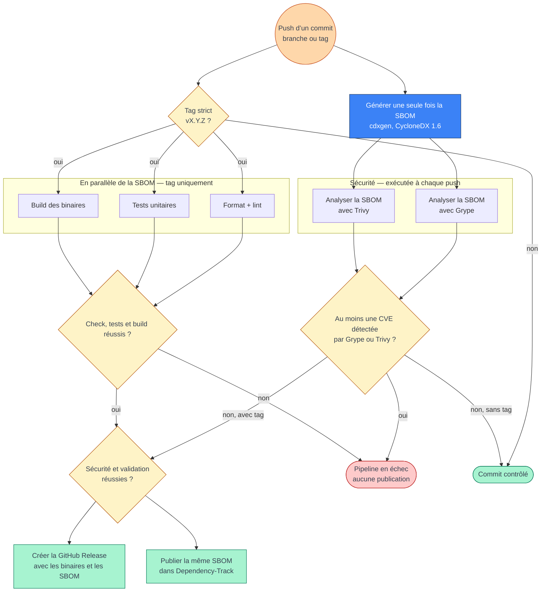

# Analyse du pipeline actuel et cible

## Problèmes actuels

Le pipeline est réparti entre `ci.yml`, `security-scan.yml` et `sbom.yml`. Cette
séparation ne garantit pas qu’une release et sa publication Dependency-Track
proviennent d’un scan réussi.

| Problème | Conséquence | Modification |
|---|---|---|
| `security-scan.yml` écoute les branches, pas les tags | Un tag de release ne lance ni Grype ni Trivy dans ce workflow | Déclencher un workflow unique sur tous les `push`, tags inclus |
| La release de `ci.yml` ne dépend pas des scans | Une release peut être créée malgré une CVE | Faire dépendre la release d’un job de sécurité réussi |
| `sbom.yml` utilise une autre génération SBOM et seulement Grype | Trivy ne protège pas la publication Dependency-Track | Générer une seule fois puis analyser le même artefact avec les deux outils |
| `sbom.yml` accepte tous les tags, tandis que la release accepte `v*` | Un tag non versionné peut être envoyé à Dependency-Track | Valider strictement `^v[0-9]+\.[0-9]+\.[0-9]+$` |
| Trois workflows s’exécutent indépendamment | Pas de garde commun avant les publications | Remplacer les trois chemins par `pipeline.yml` |
| `check`, `test` et `build` tournent sur tous les pushes | Travail inutile par rapport au besoin exprimé | Les exécuter uniquement pour un tag de release valide |

## Pipeline cible



## Dépendances de jobs recommandées

```text
push
├── sbom → grype + trivy ───────────┐
└── tag vX.Y.Z → check + test + build ┴── garde finale
                                           ├── GitHub Release
                                           └── Dependency-Track
```

La SBOM et les binaires sont transmis entre jobs avec les artefacts GitHub
Actions. `release` et `dtrack` attendent les deux scans, le lint, les tests et le
build, mais ces deux groupes s’exécutent désormais en parallèle.

## Changements réalisés

1. `workflows/pipeline.yml` contient désormais cette chaîne unique.
2. Le workflow réutilise `make lint`, `make test-unit`, `make all` et
   `scripts/ci/prepare-release-assets.sh` déjà présents.
3. `workflows/ci.yml`, `workflows/security-scan.yml` et `workflows/sbom.yml` ont
   été supprimés pour éviter les exécutions et publications en double.

Le diagramme applique littéralement « une CVE trouvée = échec ». Cela implique
un seuil incluant toutes les sévérités dans Grype et Trivy ; il pourra être
resserré à `HIGH,CRITICAL` si les vulnérabilités faibles ne doivent pas bloquer.
