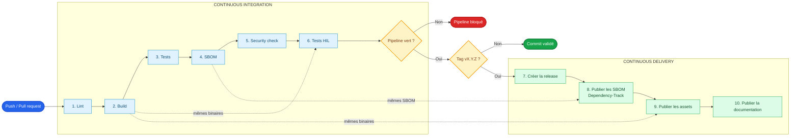

# Bonnes pratiques CI/CD

Ce document décrit le pipeline cible du projet. Son principe essentiel est de
construire une seule fois, de valider exactement ce qui a été construit, puis de
publier ces mêmes fichiers sans les reconstruire.

## Vue d'ensemble

## Pipeline de validation

Le pipeline est lancé pour chaque commit poussé et chaque pull request. Chaque
étape ne démarre que si la précédente a réussi.

1. **Lint** : vérifie le formatage et les règles Rust, Python et Markdown. Cette
   étape rapide échoue avant de consommer du temps de compilation.
2. **Build** : compile le bootloader, les firmwares et les outils. Les fichiers
   obtenus sont enregistrés comme artefacts du workflow.
3. **Tests** : exécute les tests unitaires et les tests logiciels sans matériel.
4. **SBOM** : produit les inventaires CycloneDX à partir du commit et des
   dépendances verrouillées utilisés pour le build.
5. **Security check** : analyse les SBOM avec Grype et Trivy. Une vulnérabilité
   dépassant le seuil défini, par exemple `HIGH`, bloque le pipeline.
6. **HIL (Hardware-in-the-Loop)** : télécharge les artefacts du build, les
   installe sur une carte réelle et exécute les tests d'intégration. Ce job doit
   utiliser un runner dédié, sérialisé par carte pour éviter deux tests
   simultanés sur le même matériel.

Un échec arrête la chaîne. Aucune release ni publication ne doit avoir lieu à
partir d'un pipeline incomplet.

## Pipeline de release

Un commit validé n'est pas automatiquement une nouvelle version. La publication
est déclenchée par un tag versionné, par exemple `v1.2.3`, posé sur un commit dont
tous les contrôles précédents ont réussi.

1. **Création de la release** : crée la version et ses notes à partir du tag.
2. **Publication SBOM** : envoie à Dependency-Track les SBOM déjà contrôlés. Le
   nom du projet, la version et le hash du commit doivent identifier précisément
   la release.
3. **Publication des assets** : joint à la release les binaires déjà testés par
   le HIL, ainsi que leurs sommes de contrôle. Aucun rebuild n'est effectué.
4. **Publication de la documentation** : publie la documentation correspondant
   au même tag et ajoute un lien vers la release.

Si une publication échoue, elle doit pouvoir être relancée avec les artefacts du
même pipeline, sans recréer une version ni recompiler les binaires.

## Règles à conserver

- Un seul build et une seule génération de SBOM par commit.
- Les scans, le HIL et la release consomment les artefacts produits en amont.
- Les secrets de Dependency-Track et de publication sont accessibles uniquement
  aux jobs de release, idéalement via un environnement GitHub protégé.
- Les actions et les outils sont épinglés à des versions connues.
- Une seule exécution est autorisée par carte HIL.
- Les artefacts, les SBOM et la documentation portent tous la même version et le
  même commit source.
